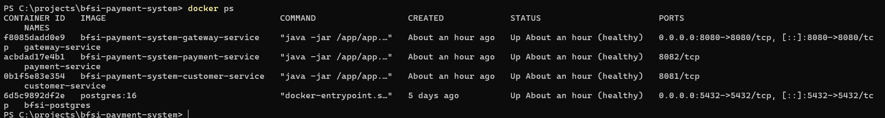
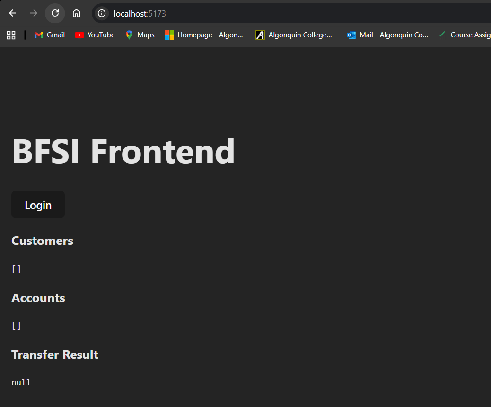
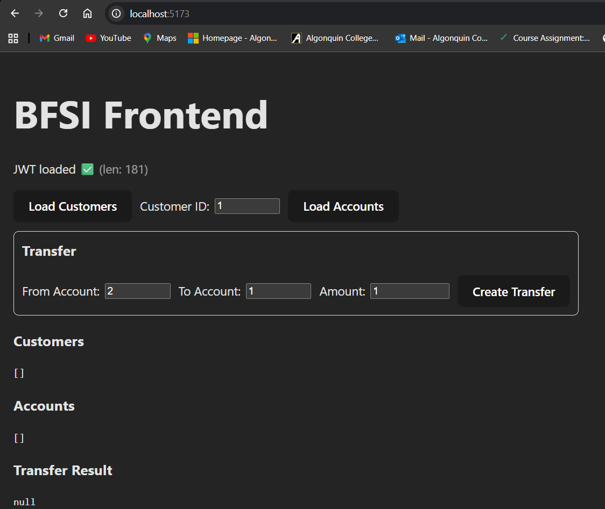
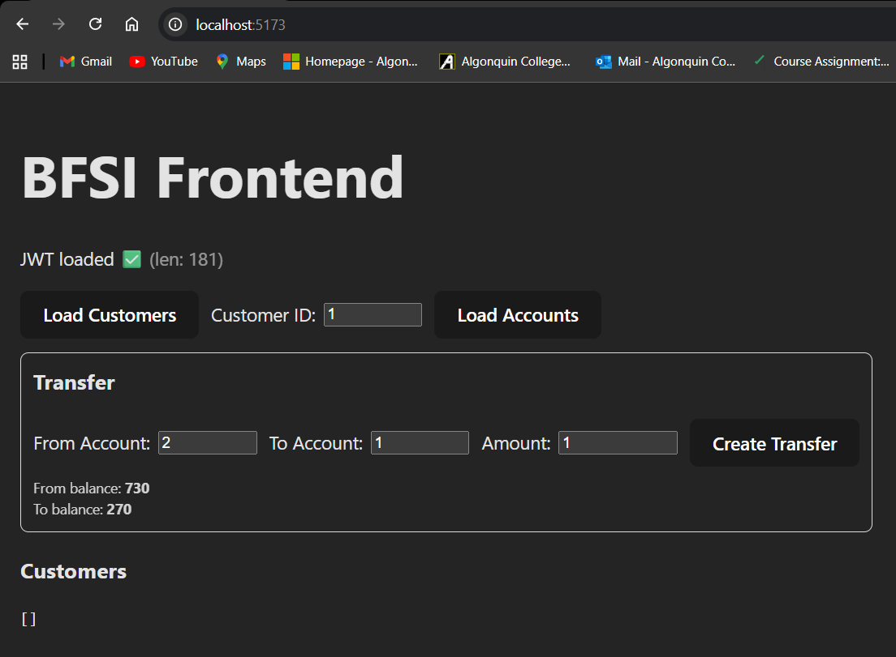
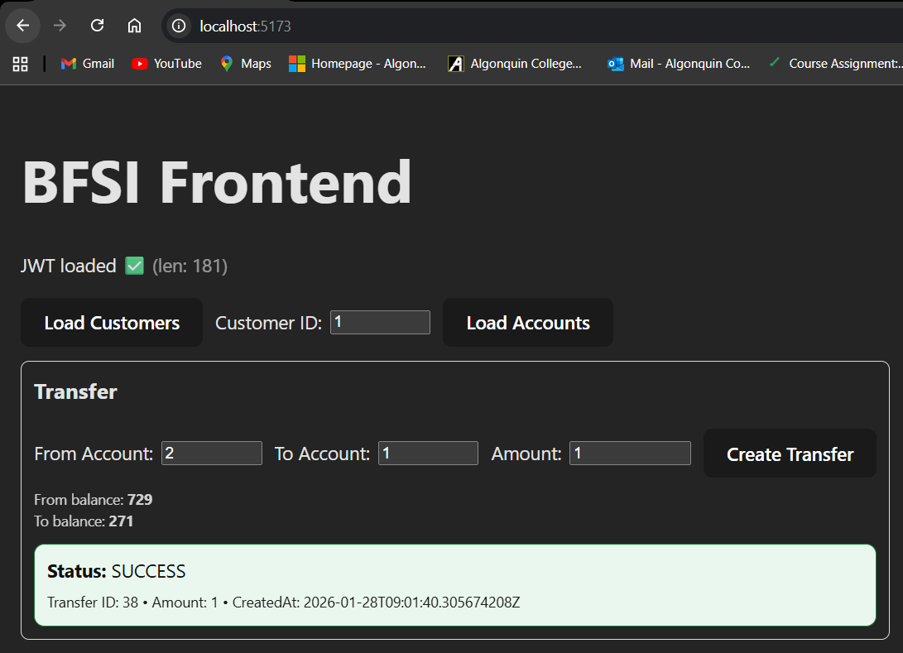
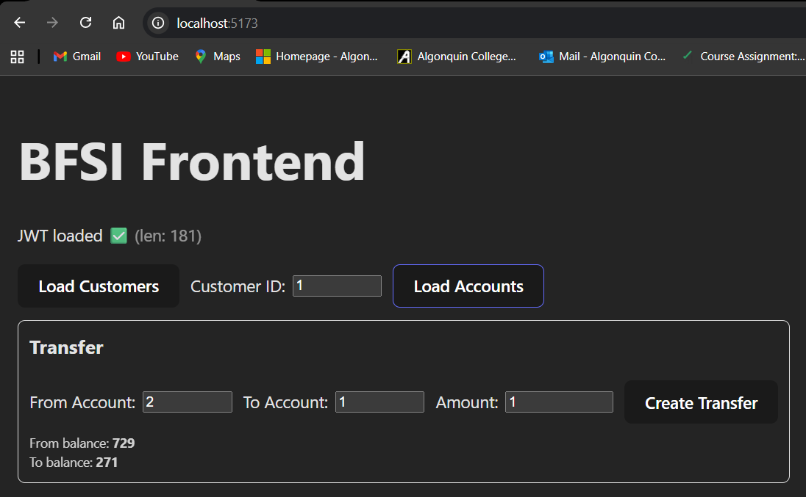

# BFSI Payment System – Full Stack Microservices Project

A complete **banking-style payment system** built using **Spring Boot microservices**, **PostgreSQL**, **Docker**, and a **React frontend**.

This project demonstrates **real-world backend architecture**, **JWT authentication**, **inter-service communication**, **Docker networking**, and a working **React UI**.

---

## 📌 Project Overview

The BFSI Payment System allows users to:

- Login securely using JWT authentication
- View customers and their accounts
- Transfer money between accounts
- See real-time balance updates
- Handle failed transactions (e.g., insufficient balance)

---

## 🏗 Architecture

### Backend (Dockerized Microservices)

- **Gateway Service**
    - API Gateway
    - JWT authentication
    - CORS handling
- **Customer Service**
    - Customers
    - Accounts
    - Transfers
- **Payment Service**
    - Payment processing
    - Validation & failure handling
- **PostgreSQL**
    - Central database

### Frontend

- **React (Vite)**
- Communicates only with **Gateway Service**

## System Architecture

```text
React (localhost:5173)
        ↓
Gateway Service (8080)
   ├── Customer Service (8081)
   └── Payment Service (8082)
        ↓
     PostgreSQL
```
---

## 🧰 Tech Stack

### Backend
- Java 17
- Spring Boot
- Spring Cloud Gateway
- JWT Authentication
- PostgreSQL
- Docker & Docker Compose

### Frontend
- React
- Vite
- Fetch API

---

## ▶️ How to Run the BackEnd
```bash

docker compose up -d --build

```
## ▶️Verify
```bash

docker ps

```
## ▶️How to Run the FrontEnd
```bash

cd frontend
npm install
npm run dev

```
## ▶️Open in Browser
```bash

http://localhost:5173

```
## ▶️📸 Application Flow (Screenshots)

1) Docker Containers Running\
All backend services and PostgreSQL running inside Docker.



---

2) Frontend Home Page\
Initial UI before login.



---

3) Login (JWT Authentication)\
User logs in and receives a JWT token.



---

4) Accounts Before Transfer\
Balances before transferring money.



---

5) Transfer Money\
Money transferred from one account to another.



---

6) Accounts After Transfer\
Balances updated after successful transfer.



📂 Project Structure

```text
bfsi-payment-system/
├── screenshots/
│   ├── docker.png
│   ├── homepage.png
│   ├── login.png
│   ├── accounts_before.png
│   ├── transfer.png
│   └── accounts_after.png
├── backend
├── frontend
└── README.md
```
## 👤 Author
**Parvez Malek**  
Full Stack / Backend Developer